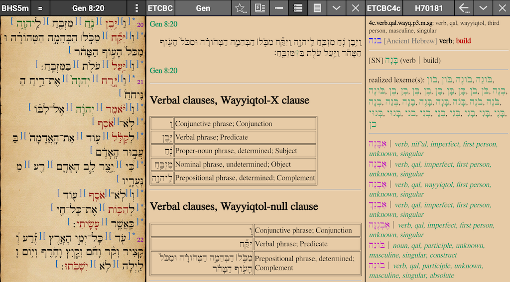

... update in progress ...

<h1>ETCBC (version 4c) - MyBible collection</h1>

created by Eliran Wong (last updated on 13/2/2017) 
This collection was created by Eliran Wong (hkwebtech@gmail.com), built on materials found at: 
- https://github.com/ETCBC/text-fabric-data/tree/master/hebrew/etcbc4c (ETCBC version 4c data in TF format) 
- https://github.com/eliranwong (derivative work by Eliran Wong) 
(You have to give proper attribution to the data when you use it in new applications.)

<h2>License</h2>

Creative Commons License 
This work is licensed under a Creative Commons Attribution-NonCommercial 4.0 International License. 
(you may find more information on creative Commons License at https://shebanq.ancient-data.org/sources) 
<b>Version of ETCBC data in this collection: 4c</b>

<h2>Application</h2>

<b>Required app:</b> MyBible (an Android app developed by Denys Dolganenko) version 4.6+ 
<b>App installation:</b> install either from apk file available at (http://mybible.zone/index-eng.php) or through google play store (https://play.google.com/store/apps/details?id=ua.mybible).   
<b>Resource installation:</b> either eternal storage or SD card; please refer to "Data directory" in settings. 

<h2>Hebrew Font</h2>

<b>Suggested font:</b> Ezra SIL ( available at http://mysword.info/download-mysword/fonts ) 
<b>Font installation:</b> copy font files to resource folder "[Internal_Storage]/MyBible/user/fonts" OR "[External_SD]/Android/data/ua.mybible/MyBible/user/fonts"; depends on where you install MyBible resources

<h2>Hebrew text</h2>

Biblia Hebraica Stuttgartensia, edited by Karl Elliger and Wilhelm Rudolph, Fifth Revised Edition, edited by Adrian Schenker, © 1977 and 1997 Deutsche Bibelgesellschaft, Stuttgart. 
(more info at: https://shebanq.ancient-data.org/sources)

  
<h2>Bible modules</h2>

<b>BHS versification:</b> 
(original versification; academic articles and lexicons use this versification) 
- BHS5.SQLite3 ( Hebrew text + tagging linked to ETCBC+ dictionary + Hebrew morphology ) 
- BHS5m.SQLite3 ( Hebrew text + tagging linked to ETCBC+ dictionary + Hebrew morphology + clause linebreak + clause marker + phrase marker + phrase-dependent verb highlighted in red + phrase-dependent proper noun emphasized )
  
<b>KJV versification:</b> 
(most bible translations use versification based on KJV with slight variations; modules below were designed for comparing Hebrew text with common translations)
- BHS5k.SQLite3 ( Hebrew text + tagging linked to ETCBC+ dictionary + Hebrew morphology ) 
- BHS5km.SQLite3 ( Hebrew text + tagging linked to ETCBC+ dictionary + Hebrew morphology + clause linebreak + clause marker + phrase marker + phrase-dependent verb highlighted in red + phrase-dependent proper noun emphasized ) 
</b> 
<b>Notes:</b>
- difference in versification between BHS and KJV are marked in the text, where applicable (e.g. Psalm 13). 
- to adjust appearance of emphasized proper noun in BHS5m or BHS5km, go to "Settings > Themes > Emaphasized words" 
- to select font at "Settings > Themes > Verse text"
  
<b>Taggings:</b> 
Each Hebrew word is tagged with following information, to work with dictionary module, "ETCBC+" 
- unique numbers assigned to ETCBC lexemes, placed next to Hebrew word 
- ETCBC morphology, placed next to assigned number of ETCBC lexeme 
- unique numbers assigned  to combinations Hebrew lexeme and morphology, placed next to morphology

<h2>Commentary module</h2>

<b>File: ETCBC.commentaries.SQLite3</b> 
  It is a verse-by-verse commentary, with three different parts on each verse, which are to be described below.

<b>PART I - Hebrew text</b> 
  - the text of Biblia Hebraica Stuttgartensia, edited by Karl Elliger and Wilhelm Rudolph, Fifth Revised Edition, edited by Adrian Schenker, © 1977 and 1997 Deutsche Bibelgesellschaft, Stuttgart. 
  - each Hebrew word is tagged and linked to ETCBC+ dictionary described later.

<b>PART II - clause and phrase analysis</b>
  
<b>Data on clause analysis:</b> 
Division of clauses is represented by use of horizontal lines, followed by headings including information below (where applicable): 
- rough clause type 
- clause type 
- clause constituent relation 
Please refere to https://etcbc.github.io/text-fabric-data/features/hebrew/etcbc4c/0_overview.html for full features.
  
<b>Data on phrase analysis:</b> 
Division of phrases is represented by use of rows in tables.  Each row has Hebrew words in each phrase on its left side and following data information on the right side, where applicalbe: 
- phrase type 
- phrase atom relation 
- determination 
- phrase function 
Please refere to https://etcbc.github.io/text-fabric-data/features/hebrew/etcbc4c/0_overview.html for full features.

<b>PART III - word analysis</b> 
Every Hebrew word in each verse is given information on: 
- first line (from right to left): qere reading (where applicable), manuscript form, transliteration, Hebrew lexeme, English gloss 
- second line: morphology (tagged with unique links to facilitate searching bible modules BHS5 or BHS5[k]m for a specific combination of Hebrew lexeme and morphology) 
- to take advantage of these links, click it and seach in ETCBC+ dictionary in dicitonary window (select BHS5 or BHS5[k]m in seach window in case current active bible is a module other than these), you should expect a list of all verses having the same set of combination of Hebrew lexeme and morphology.

<b>remarks:</b> 
  - this commentary file are conformed into KJV versification, to facilitate comparisons with most common translation. 
  - where versification different from original BHS are marked and linked, i.e. users can easily navigate to BHS text in original versification. 
  - this file could be used independently or opened in parallel with different bible modules

<h2>ETCBC+ dictionary (search by assigned numbers for lexemes)</h2>

<b>File:</b> ETCBC+.dictionary.SQLite3

<b>Usage:</b> 
  MyBible has two modes for dictionary lookup, Strong's and Dictionary.  This ETCBC+ dictionary contains entries of assigned numbers, which correspond Hebrew lexemes.  To use this dictionary, select "Strong" as lookup mode and click tagged words in bible modules. 
<b>ETCBC data and derviative work:</b> 
- idealized lexeme (linked) 
- realized lexeme (linked) 
- language, part-of-speech (word), lexical set and type of named entity 
- English gloss 
- Hebrew analytical lexicon (derivative work available at https://github.com/eliranwong/Hebrew-analytical-lexicon) 
- ETCBC morphology (word and pronominal suffix) 
- morphology linked with dictionary entries combining lexeme and morphology (derivative work available at https://github.com/eliranwong/BHS-morphology) 
- phrase-dependent part-of-speech in morphology 
- integrated Strong's number mapping (derivative work available at https://github.com/eliranwong/BHS-Strong-no)

<h2>ETCBC dictionary (search by Hebrew manuscript word forms)</h2>

<b>File:</b> ETCBC.dictionary.SQLite3

<b>Usage:</b> 
MyBible has two modes for dictionary lookup, Strong's and Dictionary.  This ETCBC dictionary contains entries of Hebrew manuscript forms of words in the text of BHS.  To use this dictionary, select "Dictionary" as lookup mode and Hebrew word in bible modules. 
<b>ETCBC data and derviative work:</b> 
- Hebrew lexeme, part of speech, morphology 
- morphology linked with dictionary entries combining lexeme and morphology (derivative work available at https://github.com/eliranwong/BHS-morphology) 
- links to Hebrew analytical lexicon (derivative work available at https://github.com/eliranwong/Hebrew-analytical-lexicon) 
- integrated Strong's number mapping (derivative work available at https://github.com/eliranwong/BHS-Strong-no)

<h2>Remarks on lexemes and part-of-speech</h2>

<u>Notes on lexemes: </u> 
https://shebanq.ancient-data.org/shebanq/static/docs/featuredoc/features/comments/vocalized_lexeme.html 
The values of vocalized lexeme look like the values of the g_lex_utf8 feature of word occurrences, but they are not the same. The vocalized lexeme is an idealized (aka paradigmatic), pointed representation of the lexeme, which may or may not occur in the text. The g_lex_utf8 is the realized lexeme in a concrete occurrence, of which it may be a part.

<u>Notes on part-of-speech: </u> 
Users may find of part-of-speech information appeared in morphology different from part-of-speech information in lexical entry.  Part-of-speech information in morphology are phrase dependent part-of-speech.  You may read more below on "phrase dependent part-of-speech".

<u>Notes on phrase dependent part-of-speech: </u> 
https://etcbc.github.io/text-fabric-data/features/hebrew/etcbc4c/pdp.html 
The part of speech that is assigned to a word based on its phrase context rather than on its lexical identity.

<h2>Search on Lexeme or Lexeme together with Morphology</h2>

<b>Locate lexeme:</b>   
Typing Hebrew letters in mobile devices is fine, but typing Hebrew vowels in mobile devices is difficult, if not impossible.  
Therefore, 9236 lexemes in ETCBC 4c data are assigned with numbers from 70001 to 79236 for easier typing.  
In this MyBible collection, it is easy to check the number associated with the lexeme.  
In all bible modules in this collections, you can read article on ditionary lookup of each word, 
where you can find corresponding Hebrew lexemes and numbers assigned to them.  
For example, you will get קרא and H70027 with ETCBC dictionary on clicking יִּקְרָ֨א in Genesis 1:5.  
If you turn on display for Strong's number you can simply find 70027 right next to word.

<b>Search for words based on particular lexeme(s):</b> 
To search all variants of a particular lexeme, say, קרא , simply use Strong's number search function available in MyBile, 
by clicking the number 70027 (in dictionary window) or typing manually. 
You may also search multiple words appear in same verses, say, try to search for H70003 H70004.  (please note that a space is requited between separate nubmers in the search field)

<b>Search for combination of lexeme and morphology:</b> 
To search for lexeme together with morphological data, say יִּקְרָ֨א in Genesis 1:5 is based on lexeme קרא and its full morphology is "verb, qal, wayyiqtol, third person, masculine, singular", simply click the unique linked numbers, which are placed next to morphology codes and click search in dictionary window.  With this you will get a list of all verses having variants of קרא tagged with morphological data "verb, qal, wayyiqtol, third person, masculine, singular". You may also do a seach of it in ETCBC+ ditionary, by clicking linked morphology in analytical lexicon and proceed the search.

<h2>Extra materials:</h2>
- "strong's exhaustive concordance" added (formatted from this source: github.com/openscriptures/strongs) 
- links to various dictionaries added by Eliran Wong 
- two-way links between Strong's numbers and ETCBC data added by Eliran Wong 
- work with Strong's no. replacement feature in MyBible (version 4.6+)

<h2>Other dictionary features (installed separately)</h2>

(<b>File "Original.dictionary.SQLite3" MUST BE INSTALLED for the following features to work.</b>) 
 
- support Strong's numbers lookup 
- support other dictionary lookups 
 
Various dictionaries / lexicons had been tested with this collection.  Only non-copyrighted materials will be distributed with this collection, e.g. ETCBC(4c) dataset, SECE, BDB, Genenius, OSHL. 
Please do not ask me for copyrighted materials.

